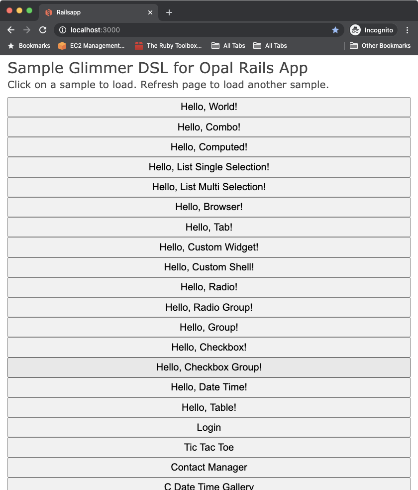

# Sample Glimmer DSL for Opal Rails App
## [ Glimmer App](https://github.com/AndyObtiva/glimmer-dsl-opal)

This is a sample app built with [Glimmer DSL for Opal](https://github.com/AndyObtiva/glimmer-dsl-opal), an experimental proof-of-concept web GUI adaptor for [Glimmer](https://github.com/AndyObtiva/glimmer) desktop app samples (i.e. samples found in [Glimmer DSL for SWT](https://github.com/AndyObtiva/glimmer-dsl-swt)). It webifies them via [Rails](https://rubyonrails.org/) and [Opal](https://opalrb.com/), allowing [Glimmer](https://github.com/AndyObtiva/glimmer) desktop app samples to run on the web without changing a line of code.

## Setup Instructions

This is a standard Rails app. As such, you may setup locally by cloning the repository and running the following commands from inside the app directory:
- `bundle`
- `rails s`

You should see all samples listed by default.

[](https://sample-glimmer-dsl-opal-app.herokuapp.com/)

## Hosted Website

You may check out a hosted website on Heroku at:

https://sample-glimmer-dsl-opal-app.herokuapp.com/

## Manual Sample Loading

Alternatively, you may load samples manually by editing `app/assets/javascripts/application.rb` and adding the code below to manually enable the sample you would like to see.

This is useful if you would like to experiment by adding your own samples or adding your Glimmer code directly inside the `Document.ready?` block.

In the version below, you can see that `glimmer-dsl-opal/samples/hello/hello_world` is the sample that is active.

```ruby
require 'glimmer-dsl-opal'
require 'puts_debuggerer'

require 'glimmer-dsl-opal/samples/hello/hello_world'
# require 'glimmer-dsl-opal/samples/hello/hello_combo'
# require 'glimmer-dsl-opal/samples/hello/hello_computed'
# require 'glimmer-dsl-opal/samples/hello/hello_list_single_selection'
# require 'glimmer-dsl-opal/samples/hello/hello_list_multi_selection'
# require 'glimmer-dsl-opal/samples/hello/hello_browser'
# require 'glimmer-dsl-opal/samples/hello/hello_tab'
# require 'glimmer-dsl-opal/samples/hello/hello_custom_widget'
# require 'glimmer-dsl-opal/samples/hello/hello_custom_shell'
# require 'glimmer-dsl-opal/samples/hello/hello_radio'
# require 'glimmer-dsl-opal/samples/hello/hello_radio_group'
# require 'glimmer-dsl-opal/samples/hello/hello_group'
# require 'glimmer-dsl-opal/samples/hello/hello_checkbox'
# require 'glimmer-dsl-opal/samples/hello/hello_checkbox_group'
# require 'glimmer-dsl-opal/samples/hello/hello_date_time'
# require 'glimmer-dsl-opal/samples/hello/hello_table'
# require 'glimmer-dsl-opal/samples/hello/hello_button'
# require 'glimmer-dsl-opal/samples/hello/hello_message_box'
# require 'glimmer-dsl-opal/samples/hello/hello_pop_up_context_menu'
# require 'glimmer-dsl-opal/samples/hello/hello_menu_bar'
# require 'glimmer-dsl-opal/samples/elaborate/login'
# require 'glimmer-dsl-opal/samples/elaborate/tic_tac_toe'
# require 'glimmer-dsl-opal/samples/elaborate/contact_manager'
# require 'samples/nebula/c_date_time_gallery.rb'
```

Here is a version of `app/assets/javascripts/application.rb` where Glimmer GUI code is added directly.

```ruby
require 'glimmer-dsl-opal'
require 'puts_debuggerer'

include Glimmer

shell {
  text 'Glimmer'
  label {
    text 'Hello, World!'
  }
}.open
```

## License

[MIT](https://opensource.org/licenses/MIT)

Copyright (c) 2020 Andy Maleh. See [LICENSE.txt](LICENSE.txt) for further details.

--

[](https://github.com/AndyObtiva/glimmer) Built with [Glimmer](https://github.com/AndyObtiva/glimmer) (Ruby Desktop Development GUI Library)
